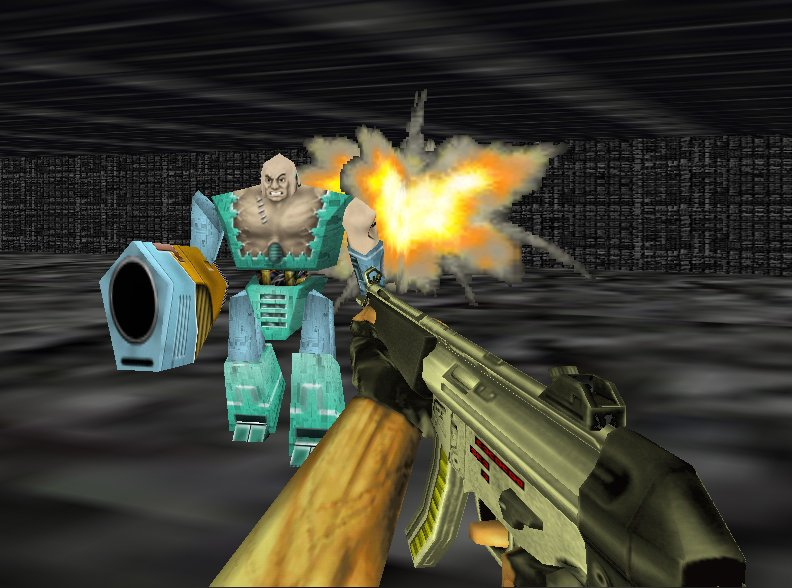

## Cyborg3D

### Description

An example how to use animated X files in

Direct3D Retain Mode and some other usefull tricks.

DirectX7 or higher needed.

For other vb games and demos visit my web site: http://web.tiscali.it/fc_vbgames/index.html
 
### More Info
 

             |
---                |---
**Submitted On**   |2002-10-04 12:30:24
**By**             |[fabio calvi](https://github.com/Planet-Source-Code/PSCIndex/blob/master/ByAuthor/fabio-calvi.md)
**Level**          |Advanced
**User Rating**    |4.8 (72 globes from 15 users)
**Compatibility**  |VB 6\.0
**Category**       |[DirectX](https://github.com/Planet-Source-Code/PSCIndex/blob/master/ByCategory/directx__1-44.md)
**World**          |[Visual Basic](https://github.com/Planet-Source-Code/PSCIndex/blob/master/ByWorld/visual-basic.md)
**Archive File**   |[Cyborg3D1406171042002\.zip](https://github.com/Planet-Source-Code/fabio-calvi-cyborg3d__1-39536/archive/master.zip)

